### Hi there 👋

## 🤔 About me
Undergraduate student passionate about neural network algorithms.  

To make an AI that composes poems and paints work like a beast of burden

<!-- clone from liyupi -->

<!-- ------------------------------------------------------ -->

## 😄 Projects

> 内容正在补全完善中（由于许多都是边学边做的，总结意识不是很强）

### LR

diffusion + 知识图谱 + 推荐系统

123

<!-- ------------------------------------------------------ -->

stable diffusion 图像生成

123

<!-- ------------------------------------------------------ -->

具身

	
    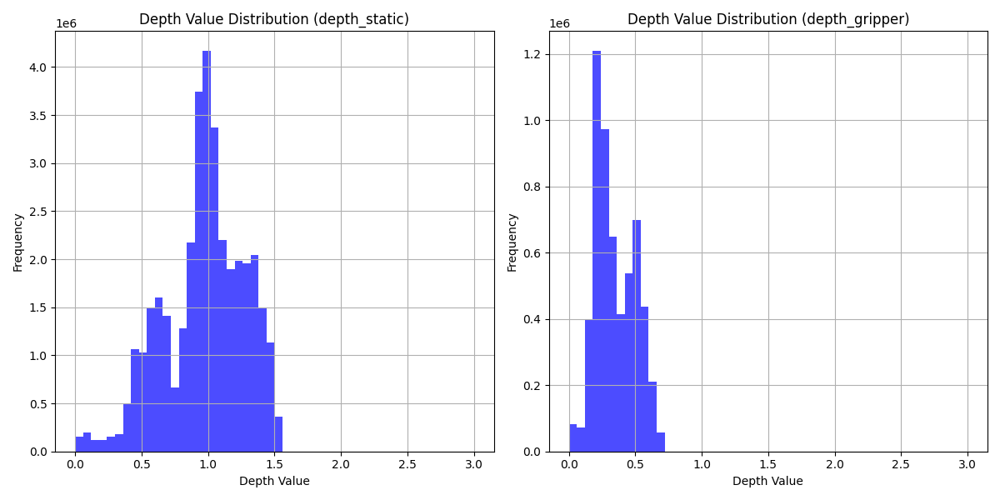
    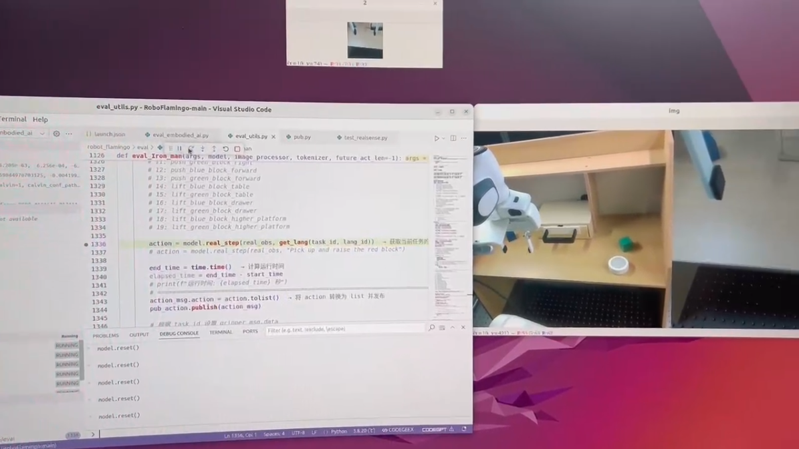
    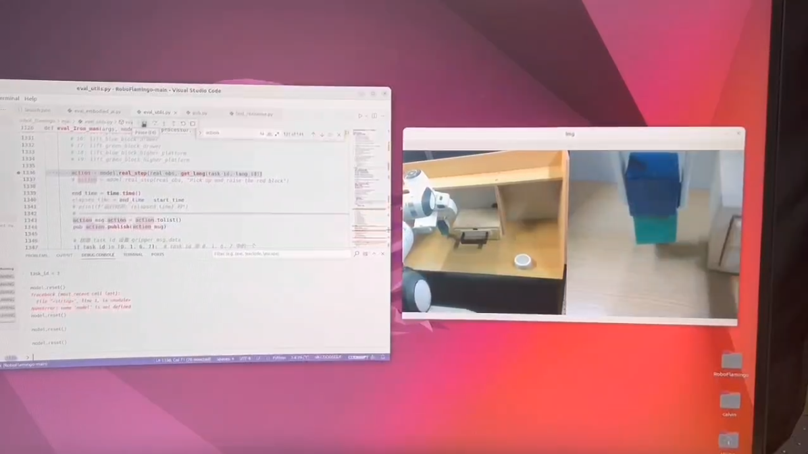

<!-- ------------------------------------------------------ -->

nanoGPT 百年孤独

	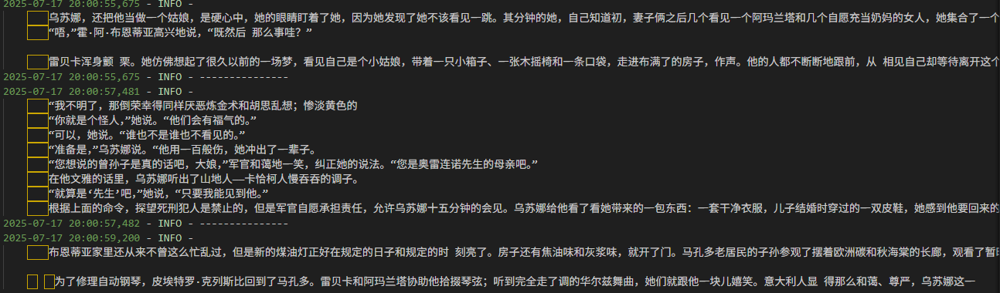

<!-- ------------------------------------------------------ -->

目标检测

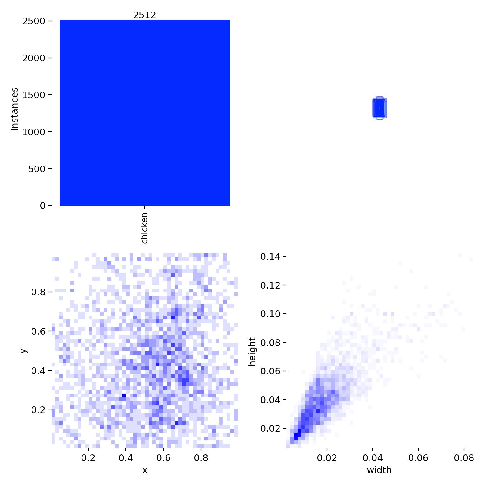

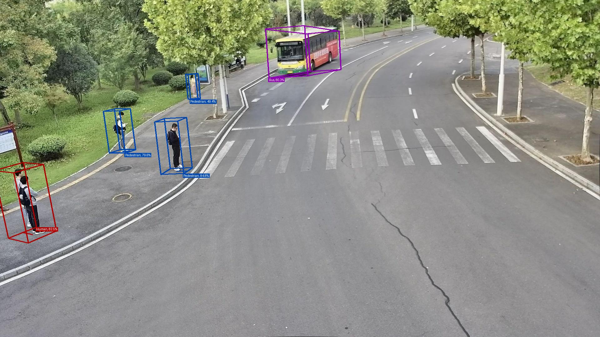

<!-- ------------------------------------------------------ -->

HFUT校门三维重建

    

        nerf + 3dgs 
    

    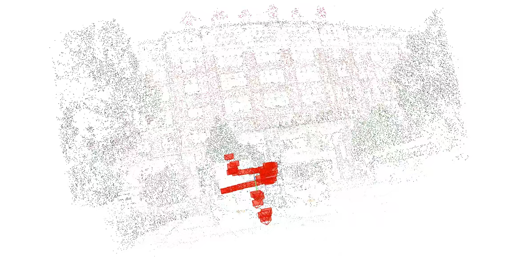
    
    

<!-- ------------------------------------------------------ -->

评论爬取 + 销量预测

	
    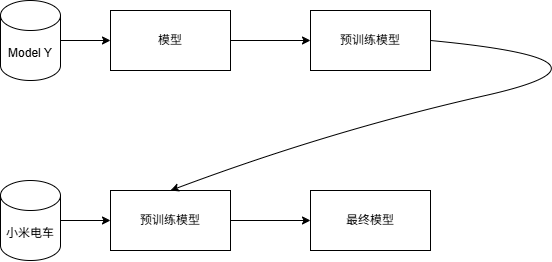
    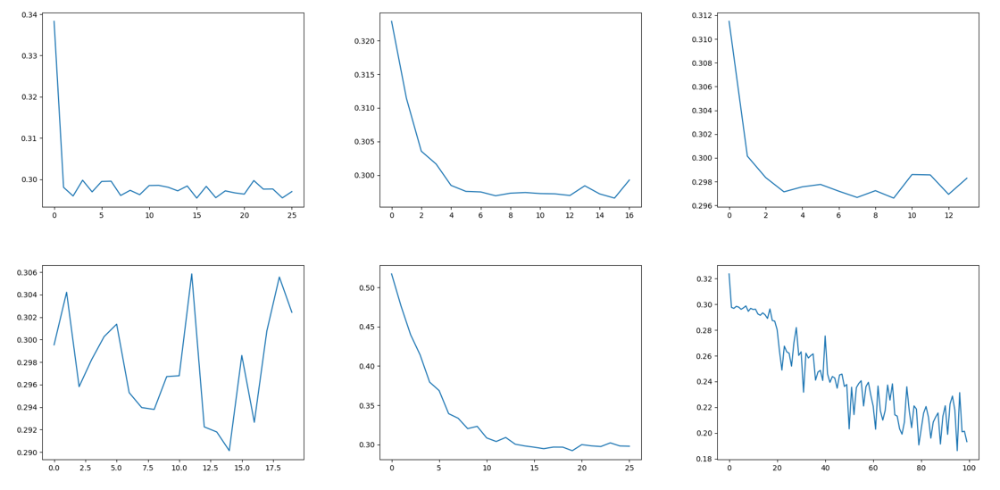

### Web

JavaSpring后端 + Vue3 校园周边美食分享系统

	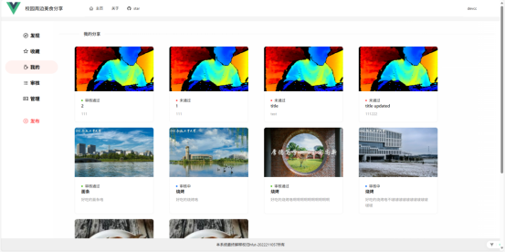
    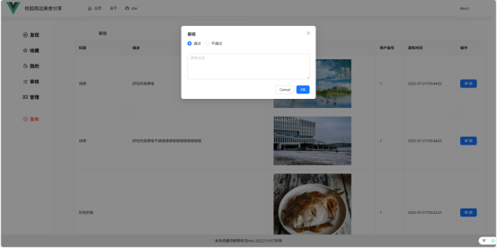
    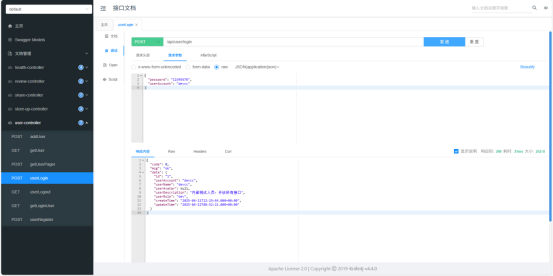
    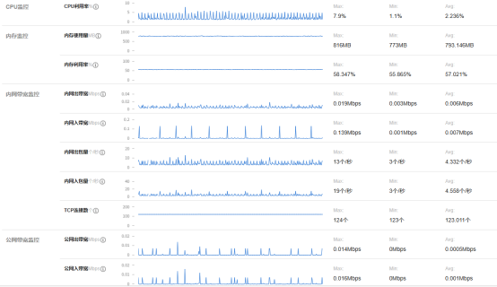

<!-- ------------------------------------------------------ -->

Nodejs后端 + Vue3 +微信小程序 辅学系统

123

<!-- ------------------------------------------------------ -->

JavaSpring后端 + ReactNative 日常工具APP

123

